This activity was created by harnakam and soinagak as part of the 42 curriculum.
# push_swap

## 目次

- [概要](#概要)
- [push_swapの全体フロー](#push_swapの全体フロー)
- [特徴](#特徴)
- [使用できる命令](#使用できる命令)
- [ビルド](#ビルド)
- [使い方](#使い方)
- [Disorderの仕組み](#disorderの仕組み)
- [ソート戦略](#ソート戦略)
- [ベンチマーク表示](#ベンチマーク表示)
- [Bonus: checker](#bonus-checker)
- [ファイル構成](#ファイル構成)
- [コメント付きソースのバックアップ](#コメント付きソースのバックアップ)
- [クリーンアップ](#クリーンアップ)
- [参考資料](#参考資料)
- [AIの使用について](#aiの使用について)

[English version](README_EN.md)

## 概要

このプロジェクトは、42カリキュラムの課題として作成した`push_swap`です。
2つのスタックA・Bと限られた命令だけを使い、整数列をできるだけ少ない
操作回数で昇順に並べます。

`push_swap`は整数列を受け取り、整列に必要な命令を1行ずつ標準出力へ
表示します。整数以外、`int`の範囲外、重複した整数などの不正な入力では、
標準エラー出力へ`Error`を表示します。

## push_swapの全体フロー

`main()`の処理順は次のとおりです。戦略オプションがなければ、入力数と
Disorderを使って戦略を選びます。

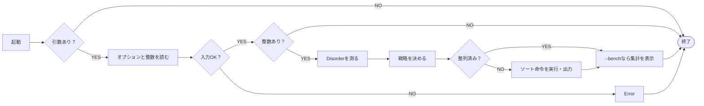

ソート命令は通常、ソート処理中に1行ずつ出力されます。`--bench`の結果は
標準エラー出力へ分けるため、命令列を`checker`へ渡すパイプを壊しません。

## 特徴

- 入力の要素数と乱れ具合に応じたソート戦略の自動選択
- 4種類のソート戦略をコマンドラインから明示的に指定可能
- 操作回数、使用戦略、計算量、初期Disorderを確認できるベンチマーク表示
- Bonusの`checker`による命令列の検証
- コメントなしの提出用ソースと、コメント付き学習用ソースを分離

## 使用できる命令

| 命令 | 動作 |
|---|---|
| `sa` / `sb` | スタックA / Bの先頭2要素を交換する |
| `ss` | `sa`と`sb`を同時に実行する |
| `pa` | スタックBの先頭要素をスタックAへ移す |
| `pb` | スタックAの先頭要素をスタックBへ移す |
| `ra` / `rb` | スタックA / Bを上方向へ1つ回転する |
| `rr` | `ra`と`rb`を同時に実行する |
| `rra` / `rrb` | スタックA / Bを下方向へ1つ回転する |
| `rrr` | `rra`と`rrb`を同時に実行する |

## ビルド

Mandatoryの`push_swap`をビルドします。

```sh
make
```

Bonusの`checker`をビルドします。

```sh
make bonus
```

コンパイルには`cc`と`-Wall -Wextra -Werror`を使用します。

## 使い方

整数を引数として渡します。先頭の整数がスタックAの先頭要素です。

```sh
./push_swap 2 1 3 6 5 8
```

複数の整数を1つの文字列として渡すこともできます。

```sh
./push_swap "2 1 3 6 5 8"
```

引数がない場合は何も表示せず終了します。不正な入力では`Error`を標準
エラー出力へ表示します。

```sh
./push_swap 0 one 2 3
./push_swap 1 2 2 3
./push_swap 2147483648
```

### `shuf`でランダム入力を作る

`shuf`を使うと、重複のないランダムな入力をすぐ作れます。次の例は
`0〜99`から10個を選び、空白区切りの1行にまとめます。

```sh
ARG="$(shuf -i 0-99 -n 10 | xargs)"
echo "$ARG"
./push_swap "$ARG" | ./checker "$ARG"
```

`checker`が`OK`なら、出力した命令で正しく整列できています。同じ入力の
命令数は次のように数えます。

```sh
./push_swap "$ARG" | wc -l
```

100個で試す場合は、選ぶ個数を変えます。

```sh
ARG="$(shuf -i 0-9999 -n 100 | xargs)"
./push_swap "$ARG" | ./checker "$ARG"
./push_swap "$ARG" | wc -l
```

`shuf -i`は指定した範囲から重複なしで選びます。macOSでGNU Coreutils版を
`gshuf`として導入している場合は、`shuf`を`gshuf`へ置き換えてください。

## Disorderの仕組み

Disorderは、入力が「どれくらい昇順から外れているか」を`0.0`から`1.0`
で表す値です。この実装では、順番が逆になっている2要素の組、つまり
**逆転ペア（inversion）**の割合を使います。

入力を`x[0], x[1], ..., x[n - 1]`とすると、前にある要素`x[i]`が後ろの
要素`x[j]`より大きい組（`i < j`かつ`x[i] > x[j]`）が逆転ペアです。

> 全ペア数 = `n × (n - 1) ÷ 2`
>
> Disorder = `逆転ペア数 ÷ 全ペア数`

### 例：`3 1 4 2`

4要素から2要素を選ぶ全ペアは`4 × 3 ÷ 2 = 6`組です。左から右へ順番を
保ったまま、すべての組を調べます。

| ペア | 判定 | 理由 |
|---|---|---|
| `(3, 1)` | 逆転 | `3 > 1` |
| `(3, 4)` | 正常 | `3 < 4` |
| `(3, 2)` | 逆転 | `3 > 2` |
| `(1, 4)` | 正常 | `1 < 4` |
| `(1, 2)` | 正常 | `1 < 2` |
| `(4, 2)` | 逆転 | `4 > 2` |

逆転ペアは3組なので、Disorderは`3 ÷ 6 = 0.5`、つまり`50%`です。

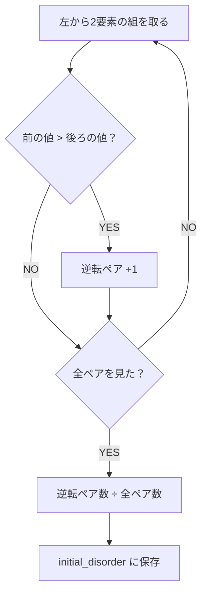

| 並びの状態 | Disorder | 意味 |
|---|---:|---|
| 完全な昇順 | `0.0`（0%） | 逆転ペアが1組もない |
| 途中まで乱れている | `0.0`より大きく`1.0`未満 | 一部のペアだけが逆転している |
| 完全な降順 | `1.0`（100%） | 全ペアが逆転している |

実装では`count_inversions()`が各要素と、それより後ろの全要素を比較します。
そのためDisorderの計算時間は`O(n²)`ですが、ここでは`sa`や`pb`などの
ソート命令を一切出力しません。計算した値は`initial_disorder`へ保存され、
Adaptiveの戦略選択と`--bench`表示の両方で同じ値を使います。

## ソート戦略

オプションを指定しない場合は`--adaptive`が使用されます。

### 図の読み方：TOP・BOTTOM・empty

スタックは、数字を上から出し入れする箱です。このREADMEでは次の言葉を
使います。

| 表記 | 意味 |
|---|---|
| `TOP` / 先頭 / 手前 | 一番上。`sa`、`pa` / `pb`、`ra`などの基準になる場所 |
| `BOTTOM` / 末尾 / 奥 | 一番下 |
| `empty` / 空 | 数字が1個も入っていない状態。`0`が入っている意味ではない |

次のStack Aでは、`3`がTOP、`2`がBOTTOMです。矢印は上から下への並び順を
表しており、ソート命令ではありません。Stack Bは空です。

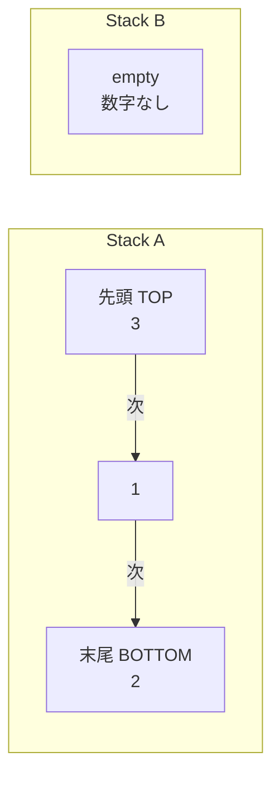

短く書くと`A = [3, 1, 2]`、`B = []`です。`[`のすぐ右にある数字がTOPで、
`[]`はemptyを表します。

たとえば`pb`は、AのTOPを取り出してBのTOPへ置きます。

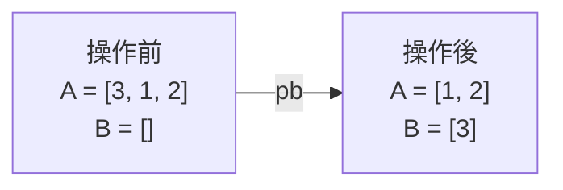

`ra`はAのTOPをBOTTOMへ、`rra`はAのBOTTOMをTOPへ動かします。Mediumの
説明に出てくる「Bの手前」はTOP、「Bの奥」はBOTTOMのことです。

### このREADMEでのBig-O

`n`は入力された数字の個数です。Big-Oは正確な命令数ではなく、`n`が
増えたときに命令数がどう伸びるかを表します。

| 表記 | 増え方のイメージ |
|---|---|
| `O(n)` | 入力を1周する |
| `O(n log n)` | 入力を何周かするが、周回数はゆっくり増える |
| `O(n√n)` | 入力をおよそ`√n`周する |
| `O(n²)` | 入力をおよそ`n`周する |

見るのは「1周の命令数」と「何周するか」です。

> 1周で最大`n`命令 × 最大`n`周 = `n²` → `O(n²)`

同じ`O(n²)`でも実際の命令数は違いますし、整列済みなら早く終わります。
ここでは内部処理の速さではなく、`sa`や`pb`などの**出力命令数**を比較
しています。

### 準備：値を順位へ変換する

Medium、Complex、Ultraは、元の数字を小さい順の**順位**へ変換してから
考えます。最小値を`0`、次を`1`、最大値を`n - 1`にします。

| 入力位置 | 1 | 2 | 3 | 4 |
|---|---:|---:|---:|---:|
| 元の値 | `40` | `-10` | `7` | `20` |
| 変換後の順位 | `3` | `0` | `1` | `2` |

値を小さい順に並べると`-10, 7, 20, 40`なので、それぞれの順位は
`0, 1, 2, 3`です。入力順へ戻すと`3, 0, 1, 2`になります。

値が`-10`でも`1000000`でも、4個なら順位は必ず`0`から`3`です。これで
「値そのものの大きさ」ではなく「何番目に小さいか」だけを使えます。

この順位付けは準備作業であり、`sa`や`pb`などの命令を出力しません。
したがって、ここで数えている**出力命令数**には加えません。

### Simple：Spin Bubble Sort

SimpleはStack Bを使いません。順位への変換もせず、Stack Aだけを回して
並べます。名前は次の2つの動きから付けています。

| 言葉 | 動き |
|---|---|
| Spin | `ra`でAを回し、次の2個をTOPへ持ってくる |
| Bubble | TOPの隣り合う2個を比べ、逆順なら`sa`で交換する |

見るのは、いつもAのTOPにある2個です。

1. 上の2個が大きい順なら、`sa`で入れ替える
2. `ra`で一番上を一番下へ送り、次の2個を見る
3. 一周の途中で交換があり、まだ整列していなければ、もう一周する

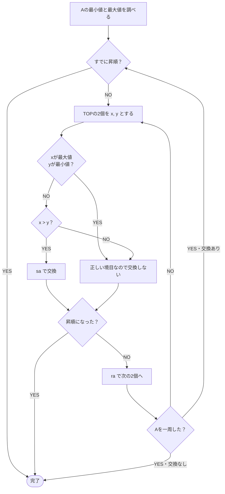

#### 具体例：`4 2 3 1`を最後まで並べる

最小値は`1`、最大値は`4`です。左端がTOPです。

> `A = [4, 2, 3, 1]`

**1. TOPの`4`と`2`を比べる**

`4 > 2`なので逆順です。`sa`で交換します。

> `sa` → `A = [2, 4, 3, 1]`

まだ昇順ではないので、`ra`で`2`をBOTTOMへ送り、次の2個をTOPへ出します。

> `ra` → `A = [4, 3, 1, 2]`

**2. TOPの`4`と`3`を比べる**

`4 > 3`なので、もう一度`sa`します。

> `sa` → `A = [3, 4, 1, 2]`

次を見るために`ra`します。

> `ra` → `A = [4, 1, 2, 3]`

**3. TOPの`4`と`1`を比べる**

数字だけ見れば`4 > 1`ですが、`4`は最大値、`1`は最小値です。この2個は
円の終わりと始まりにあたる正しい境目です。そのため`sa`しません。

`ra`で最大値`4`をBOTTOMへ送ります。

> `ra` → `A = [1, 2, 3, 4]` ← 昇順

実際に出力される命令は5個です。

```text
sa
ra
sa
ra
ra
```

#### なぜ最大値と最小値を交換しない？

Stack Aを輪として見ると、昇順は`1 → 2 → 3 → 4 → 1`と一周します。
`4 → 1`だけは数字が小さく戻りますが、これは逆順ではなく、最大値から
最小値へ戻る境目です。ここを交換せず、`ra`で`1`をTOPに合わせれば完成です。

#### なぜ`O(n²)`？

一周では、最大`n`組のとなり同士を見ます。1組につき出力するのは、最大で
交換の`sa`と回転の`ra`です。つまり一周の命令数は`2n`以下の規模なので
`O(n)`です。

逆順に近い並びでは、この一周を最大`n`回ほど繰り返します。

> 1周あたり`O(n)` × 最大`O(n)`周 = `O(n²)`

すでに整列されている、または乱れが小さい入力では早く終了できます。
そのためSimpleは、少数または低Disorderの入力に向いています。

### Medium：Spin Run Insertion

`Spin Run Insertion`は一般的なアルゴリズム名ではなく、この実装で付けた
名前です。それぞれの言葉は、ここでは次の処理を指します。

| 言葉 | この実装での意味 |
|---|---|
| Spin | `ra`、`rb`、`rrb`でスタックを回す |
| Run | Bへ送ってよい順位の範囲を少しずつ動かす |
| Insertion | Bの最大値を1個ずつAの先頭へ戻す |

一般的なソート用語のRunは「すでに並んでいる連続部分」を指しますが、
ここでのRunはそれとは違います。また、一般的なInsertion Sortのように
途中へ差し込む処理でもありません。あくまでこの実装内での呼び名です。

処理は2段階です。

1. **Run**：Aの数字をすべてBへ送り、Bをだいたいの順番にする
2. **Insertion**：Bの最大値から順にAへ戻す

#### Runをどう使う？

一度にどこまでBへ送ってよいかを決める数字が`width`です。

- `n = 9`なら`3 × 3 = 9`なので`width = 3`
- `n = 10`なら`3 × 3`では足りず、`4 × 4 = 16`なので`width = 4`

つまり`width`は、`width × width >= n`になる最小の整数です。

ここでの`width`は「受け入れる個数」ではなく、`accepted`から何順位先まで
見るかという**距離**です。条件は`順位 <= accepted + width`なので、
`accepted = 0`、`width = 3`なら順位`0, 1, 2, 3`を受け入れます。両端を
含むため、対象は3個ではなく4個です。

`accepted = a`、`width = w`とすると、先読みする順位は次の範囲です。

> `a < 順位 <= a + w`

この範囲にある整数は`a + 1`から`a + w`までの、ちょうど`w`個です。
`<=`を使うことで、`width`個先までを含めています。これとは別に、まだAに
残っている小さい順位`0〜a`も`pb → rb`で受け入れます。そのため最初の
`a = 0`、`w = 3`では、`0`と先読み部分`1, 2, 3`を合わせた`0〜3`が対象です。

##### なぜ`width ≈ √n`？

`width`を`w`とすると、狭すぎても広すぎても回転が増えます。

- `w`が小さい：受け入れられない値が多く、Aを`ra`で何度も探す
- `w`が大きい：Bの並びが粗くなり、最大値を探す`rb` / `rrb`が増える

この2つを大まかに見積もると、全体の命令数は次の形になります。

> 探索コスト：`n² / w`
>
> 復元コスト：`n × w`
>
> 合計：`T(w) ≈ n² / w + n × w`

`w`を大きくすると前半は減り、後半は増えます。2つが同じ規模になる場所を
求めると、`n² / w = n × w`なので、`w² = n`、つまり`w = √n`です。

実際のコードでは整数が必要なため、`w² >= n`になる最小の整数、
`ceil(√n)`を使っています。これは計算しやすい基準値であり、すべての入力で
命令数が最小になることを証明する値ではありません。

より正確に定数を含めて`T(w) ≈ A × n² / w + B × n × w`と置くと、最適な
幅は`w ≈ √(A / B) × √n`です。この実装は係数を`1`とした単純な基準を採用
しています。

もう1つ、`accepted`という数を使います。これは「AからBへ送った個数」です。
Bへ1個送るたびに`accepted`を1増やすので、送ってよい順位の範囲も1つずつ
右へ動きます。固定されたグループに3個ずつ分けるわけではありません。

`n = 9`、`width = 3`なら、最初の判定は次のように変わります。

| `accepted` | `pb → rb`でBのBOTTOM側へ | `pb`でBのTOPへ | `ra`でいったん見送る |
|---:|---|---|---|
| `0` | 順位`0` | 順位`1〜3` | 順位`4〜8` |
| `1` | 順位`0〜1` | 順位`2〜4` | 順位`5〜8` |
| `2` | 順位`0〜2` | 順位`3〜5` | 順位`6〜8` |

たとえば最初に順位`2`がAの一番上に来たら、今の範囲`1〜3`に入るので
`pb`します。すると`accepted`は`1`になり、次から順位`4`まで送れるように
なります。

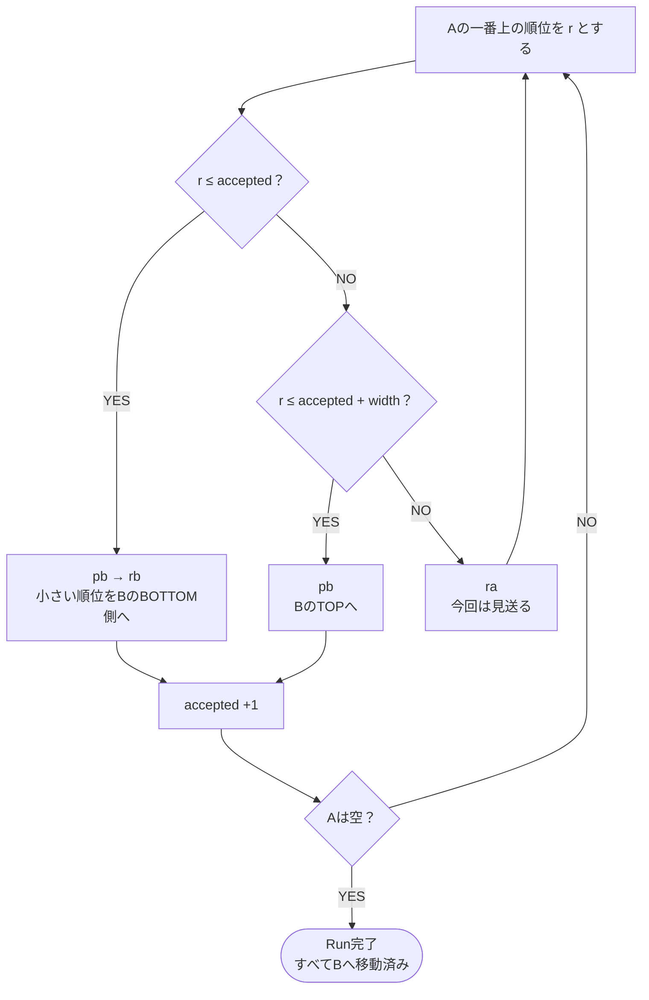

Runでは、小さい順位を`pb → rb`でBのBOTTOM側へ、それより少し大きい
順位を`pb`でBのTOPへ置きます。Bは完全な順番にはなりませんが、小さい値と
大きい値が大まかに分かれます。これが次のInsertionを短くする準備です。

##### 具体例：9個をAからBへ送る

ここからは元の値を忘れて、順位だけを見ます。左端がTOPです。

> `A = [7, 1, 4, 0, 6, 2, 8, 3, 5]`
>
> `B = []`

`n = 9`なので`width = 3`です。最初はまだBへ1個も送っていないため、
`accepted = 0`です。

**1. 順位7は、まだ送らない**

今すぐ送れるのは順位`0〜3`です。AのTOPは`7`なので大きすぎます。
`ra`で一番下へ送り、次の数字を見ます。Bへは送っていないため、
`accepted`は増えません。

> `A = [1, 4, 0, 6, 2, 8, 3, 5, 7]`
>
> `B = []`
>
> `accepted = 0`

**2. 順位1をBのTOPへ送る**

次のTOPは`1`です。今の範囲`0〜3`に入るので`pb`します。Bへ1個送ったため、
`accepted`は`0`から`1`になります。

> `A = [4, 0, 6, 2, 8, 3, 5, 7]`
>
> `B = [1]`
>
> `accepted = 1`

**3. 範囲が1つ右へ動く**

`accepted = 1`になったので、送れる範囲は順位`0〜4`へ広がりました。
AのTOPは`4`なので、これも`pb`します。

> `A = [0, 6, 2, 8, 3, 5, 7]`
>
> `B = [4, 1]`
>
> `accepted = 2`

**4. とても小さい順位0はBのBOTTOM側へ送る**

今の`accepted`は`2`です。TOPの`0`は`accepted`以下なので、`pb`のあとに
`rb`します。`pb`直後は`B = [0, 4, 1]`ですが、`rb`によって新しく入れた
`0`がBOTTOMへ移ります。

> `A = [6, 2, 8, 3, 5, 7]`
>
> `B = [4, 1, 0]`
>
> `accepted = 3`

ここまでで重要なのは、`pb`するたびに`accepted`が1増え、送れる範囲が
すぐ1つ右へ動くことです。`0〜2`を全部送ってから次へ進むわけではありません。

同じ判断を続けると、最後は次の形になります。

> `A = []`
>
> `B = [8, 6, 4, 1, 0, 2, 3, 5, 7]`

最大の`8`はTOP、次に大きい`7`はBOTTOMにあります。完全な昇順や降順では
ありませんが、大きい値が端に寄っています。

#### Insertionをどう短くする？

Bの最大値を探す処理そのものは、`rb`や`rrb`を出力しません。最大値の位置が
分かったら、上から回す`rb`と下から回す`rrb`のどちらが短いかを比べます。

Bに`m`個あり、最大値が上から`p`番目にあるとします。一番上は`p = 0`です。

| 回し方 | 最大値を一番上へ動かす回数 |
|---|---:|
| `rb` | `p`回 |
| `rrb` | `m - p`回 |

たとえばBに8個あり、最大値の位置が`p = 6`なら、`rb`では6回、`rrb`では
`8 - 6 = 2`回です。この場合は`rrb`を2回使い、最後に`pa`を1回使います。

> 現在の最大値をAへ戻す命令数 = `min(p, m - p) + 1`

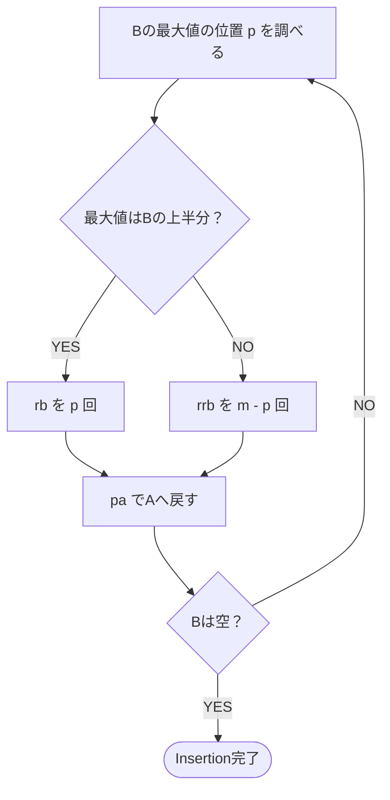

先ほど作ったBから、昇順になるまで全部戻してみます。

> `A = []`
>
> `B = [8, 6, 4, 1, 0, 2, 3, 5, 7]`

**1. 最大値8はTOPにある**

回転せず、そのまま`pa`します。

> `A = [8]`
>
> `B = [6, 4, 1, 0, 2, 3, 5, 7]`

**2. 次の最大値7はBOTTOMにある**

`rrb`でTOPへ動かし、`pa`します。

> `A = [7, 8]`
>
> `B = [6, 4, 1, 0, 2, 3, 5]`

**3. 最大値6はTOPにある**

そのまま`pa`します。

> `A = [6, 7, 8]`
>
> `B = [4, 1, 0, 2, 3, 5]`

**4. 最大値5はBOTTOMにある**

`rrb → pa`で戻します。

> `A = [5, 6, 7, 8]`
>
> `B = [4, 1, 0, 2, 3]`

**5. 最大値4はTOPにある**

`pa`で戻します。

> `A = [4, 5, 6, 7, 8]`
>
> `B = [1, 0, 2, 3]`

**6. 最大値3はBOTTOMにある**

`rrb → pa`で戻します。

> `A = [3, 4, 5, 6, 7, 8]`
>
> `B = [1, 0, 2]`

**7. 最大値2はBOTTOMにある**

`rrb → pa`で戻します。

> `A = [2, 3, 4, 5, 6, 7, 8]`
>
> `B = [1, 0]`

**8. 最大値1はTOPにある**

`pa`で戻します。

> `A = [1, 2, 3, 4, 5, 6, 7, 8]`
>
> `B = [0]`

**9. 最後の0を戻す**

`pa`で戻します。

> `A = [0, 1, 2, 3, 4, 5, 6, 7, 8]` ← 昇順
>
> `B = []` ← empty

順位ではなく元の値で書けば、`A = [1, 2, 3, 4, 5, 6, 7, 8, 9]`です。

RunでBを大まかに並べておくと、大きい値がBの端に寄りやすくなります。
そのうえで毎回短い回転方向を選ぶため、最大値をAへ戻す命令を減らせます。
ただし、最小にしているのは**今選んだ最大値を戻す回転**です。ソート全体の
命令列が必ず最短になる、という意味ではありません。

最大値から順に`pa`するので、最後はAが小さい順になります。

#### なぜ`O(n√n)`？

`width`はおよそ`√n`です。1個ずつ厳密な順番で探す代わりに、最大
`width`だけ先の順位までまとめて受け入れます。この動く範囲を使って`n`個を
探し、配置するため、出力命令数は設計上およそ次の規模になります。

> `n`個 × 幅`√n`の範囲 = `O(n√n)`

`pb`と`pa`だけなら合計`O(n)`です。そこへA・Bの回転が加わります。
`O(n√n)`はこの方式の**出力命令数の目安**で、実際の数は入力順で変わります。

### Complex：Radix Sort

Complexは、順位を2進数にして、右端のbit（桁）から1桁ずつ分けます。
bitが`0`なら`pb`でBへ、`1`なら`ra`でAに残します。一周したら、Bの値を
すべて`pa`でAへ戻し、次のbitを調べます。

`n = 8`なら順位は`0`から`7`で、必要なbitは3桁です。

| 順位 | 2進数 | 順位 | 2進数 |
|---:|:---:|---:|:---:|
| `0` | `000` | `4` | `100` |
| `1` | `001` | `5` | `101` |
| `2` | `010` | `6` | `110` |
| `3` | `011` | `7` | `111` |

`0`から`7`までは3bitで表せます。

1つのbitを調べる前に、その時点でAにある数字の個数を覚えておきます。
ここではその個数を`n`とします。`pb`でAの個数が減っても、最初に覚えた
`n`個を1回ずつ確認したら、そのbitの処理は終わりです。

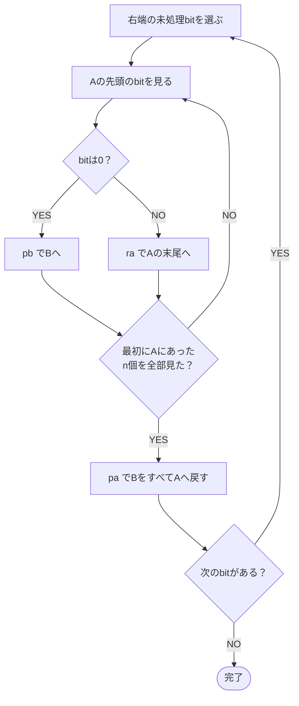

図の`n個`は「今Aに残っている個数」ではありません。このbitの処理を
始めた時点でAにあった、確認対象の総数です。

bitごとの分け方は、それより右のbitで作った順番を壊しません。そのため、
右からすべてのbitを処理すると、2進数の小さい順、つまり順位の小さい順に
並びます。

#### なぜ`O(n log n)`？

1つのbitについて、Aの`n`個をそれぞれ`pb`または`ra`で1回処理します。
そのあとBへ移した値を`pa`で戻します。したがって1bitあたり最大`2n`程度、
つまり`O(n)`命令です。

`0`から`n - 1`を表すのに必要な2進数の桁数は`ceil(log2(n))`です。

> 1bitあたり`O(n)` × 約`log2(n)`bit = `O(n log n)`

たとえば`n = 8`では3bit、`n = 16`では4bitです。数字が2倍になっても、
調べるbitは1つしか増えません。これが大きな入力に強い理由です。

### Ultra：OptiCSRI

名前は`Opti + C + SRI`に分けて読みます。これは標準的なアルゴリズム名では
なく、この実装内で付けた名前です。

| 部分 | 意味 |
|---|---|
| SRI | Spin Run Insertion。回転しながらBへ入れ、最後にAへ戻す考え方 |
| C | Circular。Bを輪として扱い、順位の降順を円の形で保つ |
| Opti | Optimization。最も安い移動を選び、同時にできる回転をまとめる |

名前の組み立ては次のとおりです。

> `SRI` → Circularの`C`を足して`CSRI` → Optimizationの`Opti`を足して
> `OptiCSRI`

#### C：Bを円として扱う

Bは、最大値から見始めれば順位の降順になるように保ちます。TOPがどこに
あっても、Bを回転すれば同じ円なので、並びは壊れません。

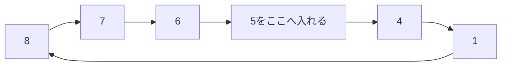

この例では、新しい順位`5`を`6`と`4`の間へ入れます。表示上のTOPが`4`でも
`1`でも、円を最大値`8`から読めば`8, 7, 6, 5, 4, 1`の降順です。

このCircularな並びを作っておくと、Aが空になったあとにBの最大値をTOPへ
合わせるのは1回だけです。その後は`pa`を繰り返すだけでAが昇順になります。

なお、UltraはMediumの`accepted`や`width`をそのまま使うわけではありません。
SRIの考え方へCircularな挿入と、次のOptiを加えた別の戦略です。

#### Opti：安い移動を選び、同じ回転をまとめる

Ultraは、「次にどの値をBへ送れば、出力命令がいちばん少ないか」を毎回
比べる欲張り（greedy）な戦略です。

各候補について、次の4通りを調べます。この比較だけでは命令を出力しません。

1. AもBも上向きに回す：`ra`と`rb`
2. AもBも下向きに回す：`rra`と`rrb`
3. Aは上、Bは下に回す：`ra`と`rrb`
4. Aは下、Bは上に回す：`rra`と`rb`

AとBの回転方向が同じ部分は、1つの命令にまとめます。

| まとめる前 | まとめた後 |
|---|---|
| `ra + rb` | `rr` |
| `rra + rrb` | `rrr` |

たとえばAを上へ3回、Bを上へ2回動かす場合、別々なら
`ra × 3 + rb × 2`で5命令です。同じ向きの2回分をまとめると、
`rr × 2 + ra × 1`の3命令になります。

> `Aの回転方向 == Bの回転方向`なら、重なる回数だけ`rr`または`rrr`へ
> まとめる

同じ向きなら移動コストはA・Bの回数の大きい方、逆向きなら回数の合計です。

> 同じ向き：`cost = max(Aの回転数, Bの回転数)`
>
> 逆向き：`cost = Aの回転数 + Bの回転数`

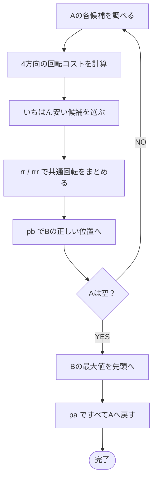

すべての候補の中から一番安い移動を実行し、Bが順位の降順を円のように
保つ場所へ`pb`します。Aが空になったらBの最大値を先頭に合わせ、すべて
`pa`でAへ戻します。

#### 出力命令数はどう増える？

値を1個Bへ送るとき、AとBの回転は最悪でスタックの長さに比例するため
`O(n)`命令です。それを`n`個について行うので、保守的な上限は次です。

> 1個を動かす最大`O(n)`命令 × `n`個 = `O(n²)`

実際には、毎回いちばん安い候補を選び、`rr`と`rrr`で共通回転をまとめる
ため、この単純な上限よりかなり少なくなることがあります。ただし、
「その時点で一番安い」を選ぶ方法であり、出力列が全体として必ず最短に
なることを証明するアルゴリズムではありません。そのためベンチマークでは
固定のBig-O名ではなく`operation optimized`と表示します。

### Adaptive：戦略を自動で選ぶ

Adaptive自身が新しい並べ方をするわけではありません。入力の個数と
Disorderを見て、Simple、Medium、Complexのどれかを選びます。Ultraは
自動では選ばれず、`--ultra`を指定したときだけ使われます。

Disorderの計算方法は[Disorderの仕組み](#disorderの仕組み)で説明したとおり
です。Adaptiveでは、保存済みの初期Disorderを次の閾値と比較します。

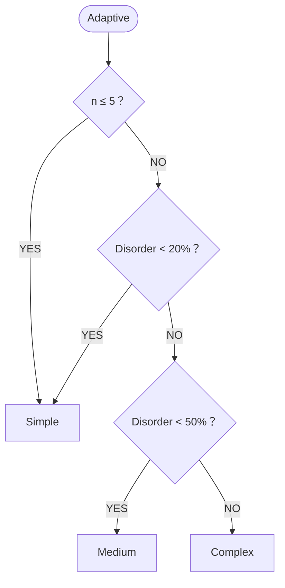

比較は「以下」ではなく「未満」です。したがって、Disorderがちょうど
20%ならMedium、ちょうど50%ならComplexへ進みます。ただし、要素数が
5以下ならDisorderに関係なくSimpleが選ばれます。UltraにはAdaptiveからの
矢印がなく、`--ultra`を明示した場合だけ使われます。

戦略選択そのものは`sa`や`pb`を出力しません。したがってAdaptiveの出力
命令数は、実際に選ばれた戦略と同じです。

### 戦略の比較

| 戦略 | 1ラウンドの規模 | ラウンド数の規模 | 出力命令数の目安 | 得意な入力 |
|---|---:|---:|---:|---|
| Simple | `O(n)` | `O(n)` | `O(n²)` | 少数・ほぼ整列済み |
| Medium | `O(n)` | `O(√n)` | `O(n√n)` | 中くらいの乱れ |
| Complex | `O(n)` | `O(log n)` bit | `O(n log n)` | 大規模・乱れが大きい |
| Ultra | 1個の移動が最大`O(n)` | `n`個 | 上限`O(n²)`、実用上の命令数を最適化 | 個々の移動を細かく節約したい場合 |
| Adaptive | 選択先による | 選択先による | 選択した戦略と同じ | 通常の自動選択 |

各戦略の違いは、「1周で何個見るか」と「何周するか」に表れます。

各戦略は明示的に指定して試せます。

```sh
./push_swap --simple 3 2 1
./push_swap --medium 8 3 7 1 6 2 5 4
./push_swap --complex 9 1 8 2 7 3 6 4 5
./push_swap --ultra 5 2 8 1 7 3 6 4
```

## ベンチマーク表示

`--bench`を付けると、初期Disorder、選択された戦略、計算量、命令ごとの
操作回数を標準エラー出力へ表示します。ソート命令は通常どおり標準出力へ
出るため、`checker`へのパイプを妨げません。

```sh
./push_swap --bench --adaptive 4 67 3 87 23
```

## Bonus: checker

`checker`はスタックAを引数として受け取り、標準入力から命令列を読みます。
すべての命令を実行したあと、スタックAが昇順でスタックBが空なら`OK`、
それ以外なら`KO`を標準出力へ表示します。不正な引数や存在しない命令では、
`Error`を標準エラー出力へ表示します。

`push_swap`が出力した命令列を検証する例:

```sh
ARG="4 67 3 87 23"
./push_swap $ARG | ./checker $ARG
```

操作回数を数える例:

```sh
ARG="4 67 3 87 23"
./push_swap $ARG | wc -l
```

手動で命令を渡すこともできます。

```sh
printf 'sa\nrra\n' | ./checker 3 2 1
```

## ファイル構成

ルート直下のソースは処理順を追いやすいように番号を付けています。

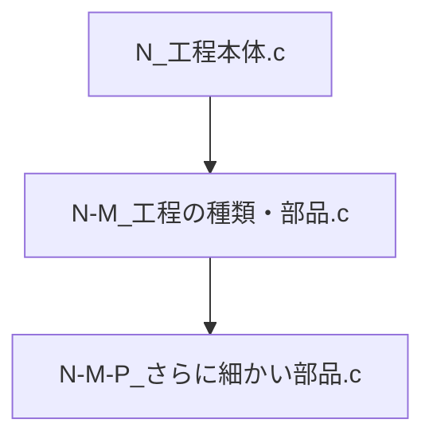

主な構成:

| パス | 役割 |
|---|---|
| `push_swap.c` / `push_swap.h` | Mandatory本体 |
| `[番号付きソース].c` | 入力処理・戦略選択・ソート・表示 |
| `utils-*.c` | スタック操作と共通処理 |
| `Libft/` | 自作Libft |
| `ft_printf/` | 自作ft_printf |
| `commented/` | コメント付きMarkdown版 |
| `commented-source-backup.tar.gz` | コメント付きCソースのバックアップ |

Bonusを提出する場合、`checker`用のソースは課題要件に従って`*_bonus.c` /
`*_bonus.h`として分離し、Makefileの`bonus`ルールからビルドします。

## コメント付きソースのバックアップ

提出・Norminette用の`.c` / `.h`からは説明コメントを除いています。コメント
付きコードは次の2形式で保存しています。

- `commented/*.md`: Cのシンタックスハイライト付きで閲覧するMarkdown版
- `commented-source-backup.tar.gz`: 実際の`.c` / `.h`を含むバックアップ

アーカイブの内容だけを確認します。

```sh
tar -tzf commented-source-backup.tar.gz
```

バックアップ内の`.c` / `.h`をNorminetteの対象にしないため、リポジトリ外の
`/tmp`へ展開する方法を推奨します。

```sh
mkdir -p /tmp/push_swap-commented
tar -xzf commented-source-backup.tar.gz -C /tmp/push_swap-commented
```

展開先は次の場所です。

`/tmp/push_swap-commented/commented-source-backup/`

確認後に削除する場合:

```sh
rm -r /tmp/push_swap-commented
```

リポジトリ内へ展開すると、コメント付き`.c` / `.h`もNorminetteの検索対象に
なる可能性があります。提出前はアーカイブのまま保持してください。

## クリーンアップ

```sh
make clean   # オブジェクトファイルを削除
make fclean  # オブジェクトファイルと実行ファイルを削除
make re      # すべて削除して再ビルド
```

## 参考資料

- [Push_swap subject](Push_swap.pdf)
- [English README](README_EN.md)

## AIの使用について

このREADMEでは図の作成やMarkdownのフォーマットに整形するなどの用途でGPT-5.6 solが使われています。
AIが提案した内容はそのまま採用せず、実装と照らし合わせて確認・修正しています。
ソースコードの生成や変更は行っていません。最終的な内容に対する責任は作者にあります。

## contribution
### soinagak
- sort_main
- sinple_sort
- medium_sort
- radix_sort
- bonus

### harnakam
- Coordinate compression
- strategy
- parse
- main
- sort_optisri
- benchmark
- utils
- debug