This activity was created by harnakam and soinagak as part of the 42 curriculum.
# push_swap

## Table of Contents

- [Overview](#overview)
- [How push_swap Works](#how-push_swap-works)
- [Features](#features)
- [Available Instructions](#available-instructions)
- [Build](#build)
- [Usage](#usage)
- [How Disorder Works](#how-disorder-works)
- [Sorting Strategies](#sorting-strategies)
- [Benchmark Output](#benchmark-output)
- [Bonus: checker](#bonus-checker)
- [File Structure](#file-structure)
- [Commented Source Backup](#commented-source-backup)
- [Cleanup](#cleanup)
- [Resources](#resources)
- [Use of AI](#use-of-ai)

[日本語版](README.md)

## Overview

This project is an implementation of `push_swap` created as part of the 42
curriculum. It sorts a sequence of integers in ascending order with two stacks,
A and B, using a restricted instruction set and as few operations as possible.

`push_swap` receives the integer sequence as command-line arguments and writes
one sorting instruction per line to standard output. Invalid input, including
non-integers, values outside the `int` range, and duplicates, produces `Error`
on standard error.

## How push_swap Works

`main()` follows this path. When no strategy option is given, the program uses
the input size and its Disorder score to select a strategy.

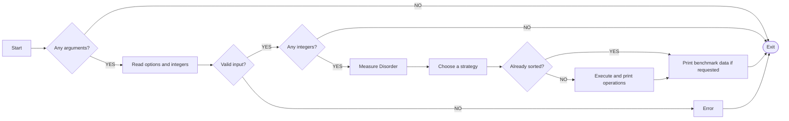

Sorting operations are normally printed one per line while sorting. Benchmark
data goes to standard error, so it does not break a pipe to `checker`.

## Features

- Automatic strategy selection based on input size and initial disorder
- Four sorting strategies that can also be selected explicitly
- Optional benchmark output with strategy, complexity, disorder, and operation counts
- A bonus `checker` for validating instruction sequences
- Separate Norm-ready source and commented learning copies

## Available Instructions

| Instruction | Effect |
|---|---|
| `sa` / `sb` | Swap the first two elements of stack A / B |
| `ss` | Execute `sa` and `sb` simultaneously |
| `pa` | Push the first element of stack B onto stack A |
| `pb` | Push the first element of stack A onto stack B |
| `ra` / `rb` | Rotate stack A / B upward by one element |
| `rr` | Execute `ra` and `rb` simultaneously |
| `rra` / `rrb` | Reverse-rotate stack A / B by one element |
| `rrr` | Execute `rra` and `rrb` simultaneously |

## Build

Build the mandatory `push_swap` program:

```sh
make
```

Build the bonus `checker` program:

```sh
make bonus
```

The project is compiled with `cc` and the flags `-Wall -Wextra -Werror`.

## Usage

Pass integers as arguments. The first integer is placed at the top of stack A.

```sh
./push_swap 2 1 3 6 5 8
```

Multiple integers may also be provided in one quoted argument.

```sh
./push_swap "2 1 3 6 5 8"
```

With no arguments, the program exits without output. Invalid input prints
`Error` to standard error.

```sh
./push_swap 0 one 2 3
./push_swap 1 2 2 3
./push_swap 2147483648
```

### Generate random input with `shuf`

`shuf` makes it easy to create random input without duplicates. This example
selects 10 values from `0` through `99` and joins them into one argument.

```sh
ARG="$(shuf -i 0-99 -n 10 | xargs)"
echo "$ARG"
./push_swap "$ARG" | ./checker "$ARG"
```

`OK` means the generated operations sorted the input correctly. Count the
operations for the same input with:

```sh
./push_swap "$ARG" | wc -l
```

For 100 values:

```sh
ARG="$(shuf -i 0-9999 -n 100 | xargs)"
./push_swap "$ARG" | ./checker "$ARG"
./push_swap "$ARG" | wc -l
```

`shuf -i` samples the range without duplicates. On macOS, if GNU Coreutils
installed the command as `gshuf`, replace `shuf` with `gshuf`.

## How Disorder Works

Disorder is a value from `0.0` to `1.0` that measures how far the input is from
ascending order. This implementation uses the proportion of **inversions**:
pairs whose values appear in the wrong order.

For `x[0], x[1], ..., x[n - 1]`, a pair is an inversion when `i < j` but
`x[i] > x[j]`.

> Number of pairs = `n × (n - 1) ÷ 2`
>
> Disorder = `number of inversions ÷ number of pairs`

### Example: `3 1 4 2`

Four values have `4 × 3 ÷ 2 = 6` pairs.

| Pair | Result | Why |
|---|---|---|
| `(3, 1)` | Inversion | `3 > 1` |
| `(3, 4)` | Correct | `3 < 4` |
| `(3, 2)` | Inversion | `3 > 2` |
| `(1, 4)` | Correct | `1 < 4` |
| `(1, 2)` | Correct | `1 < 2` |
| `(4, 2)` | Inversion | `4 > 2` |

There are three inversions, so Disorder is `3 ÷ 6 = 0.5`, or `50%`.

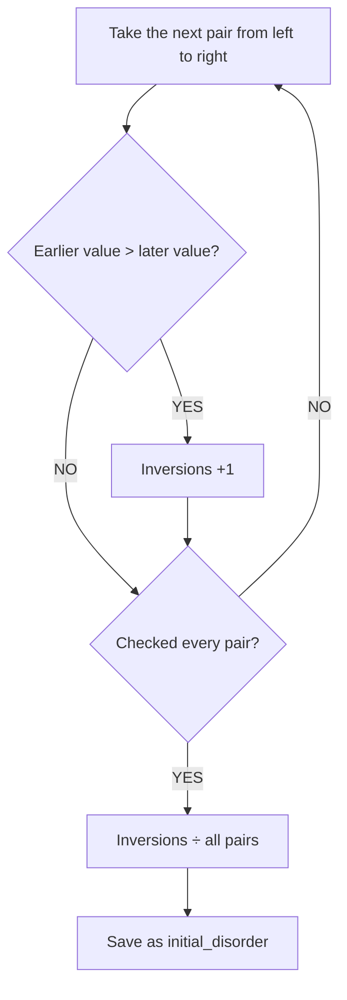

| Input order | Disorder | Meaning |
|---|---:|---|
| Fully ascending | `0.0` (0%) | No inversions |
| Partly mixed | Between `0.0` and `1.0` | Some pairs are inverted |
| Fully descending | `1.0` (100%) | Every pair is inverted |

`count_inversions()` compares every value with every value after it, so this
calculation takes `O(n²)` internal time. It prints no `push_swap` operation.
The saved score is used both for Adaptive selection and `--bench` output.

## Sorting Strategies

When no strategy option is provided, `--adaptive` is used.

### Reading the diagrams: TOP, BOTTOM, and empty

A stack is a container where values are added and removed from the top.

| Label | Meaning |
|---|---|
| `TOP` / front | The first value; operations such as `sa`, `pa` / `pb`, and `ra` start here |
| `BOTTOM` / back | The last value |
| `empty` | The stack contains no value; this does not mean it contains `0` |

In the diagram below, `3` is the TOP of A and `2` is its BOTTOM. The arrows show
the order of the values, not sorting operations. B is empty.

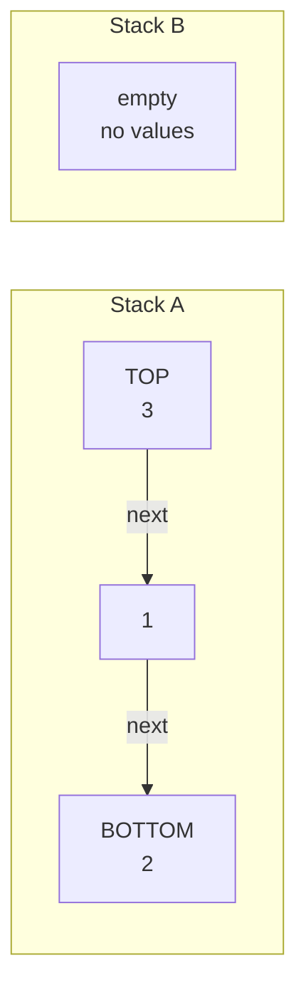

The same state can be written as `A = [3, 1, 2]` and `B = []`. The value next
to the opening `[` is the TOP; `[]` means empty.

For example, `pb` removes A's TOP and places it on B's TOP.

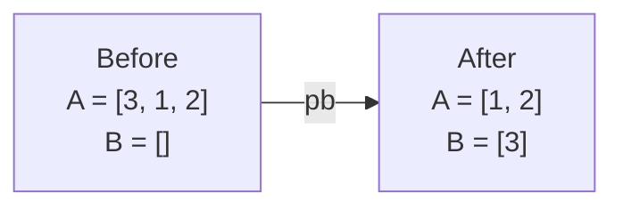

`ra` moves A's TOP to its BOTTOM. `rra` moves A's BOTTOM to its TOP.

### Big-O in this README

`n` is the number of input values. Big-O describes how operation counts grow
as `n` grows; it is not an exact operation count.

| Notation | Rough picture |
|---|---|
| `O(n)` | One pass over the input |
| `O(n log n)` | Several passes, with a slowly growing pass count |
| `O(n√n)` | About `√n` passes |
| `O(n²)` | About `n` passes |

The two questions are: how many operations does one pass need, and how many
passes are needed?

> At most `n` operations per pass × at most `n` passes = `O(n²)`

Two algorithms with the same Big-O may still produce very different operation
counts. Here Big-O refers mainly to printed `push_swap` operations, not internal
work such as ranking values or comparing candidates.

### Preparation: convert values to ranks

Medium, Complex, and Ultra assign ranks before sorting. The smallest value gets
rank `0`, the next gets `1`, and the largest gets `n - 1`.

| Input position | 1 | 2 | 3 | 4 |
|---|---:|---:|---:|---:|
| Original value | `40` | `-10` | `7` | `20` |
| Rank | `3` | `0` | `1` | `2` |

The sorted values are `-10, 7, 20, 40`, so their ranks are `0, 1, 2, 3`.
Restoring the original positions gives `3, 0, 1, 2`.

Ranking prints no sorting operation and is not included in the output operation
count.

### Simple: Spin Bubble Sort

Simple uses only stack A. It does not use B or rank conversion.

| Name | What it means here |
|---|---|
| Spin | Use `ra` to bring the next pair to the TOP |
| Bubble | Compare the two adjacent TOP values and use `sa` when reversed |

It always examines the first two values of A:

1. If the two values are reversed, swap them with `sa`.
2. Move the TOP to the BOTTOM with `ra` to expose the next pair.
3. If a pass made a swap and A is still unsorted, make another pass.

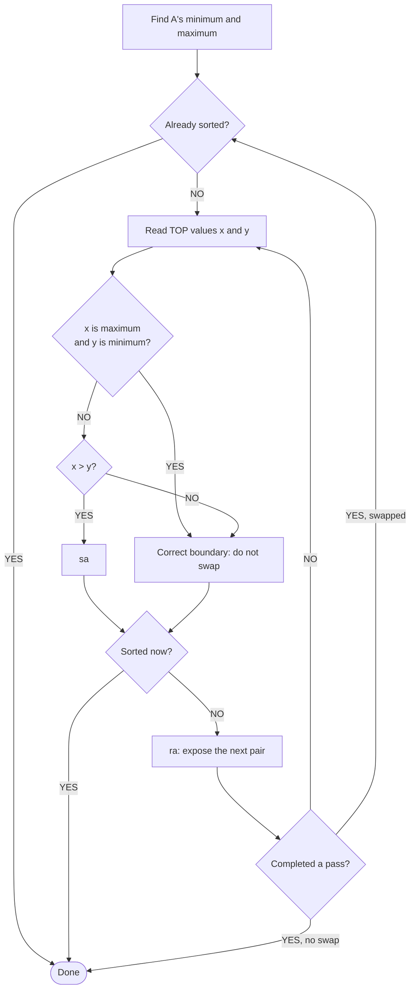

#### Complete example: sort `4 2 3 1`

The minimum is `1`, the maximum is `4`, and the leftmost value is the TOP.

> `A = [4, 2, 3, 1]`

**1. Compare `4` and `2`.** They are reversed, so use `sa`.

> `sa` → `A = [2, 4, 3, 1]`

A is not sorted, so use `ra` to move `2` to the BOTTOM.

> `ra` → `A = [4, 3, 1, 2]`

**2. Compare `4` and `3`.** They are reversed, so use `sa`, then `ra`.

> `sa` → `A = [3, 4, 1, 2]`
>
> `ra` → `A = [4, 1, 2, 3]`

**3. Compare `4` and `1`.** Although `4 > 1`, these are the maximum and
minimum. They form the correct end-to-start boundary, so do not swap them.
Rotate once to put the minimum at the TOP.

> `ra` → `A = [1, 2, 3, 4]` — sorted

The five printed operations are:

```text
sa
ra
sa
ra
ra
```

Viewed as a circle, ascending order is `1 → 2 → 3 → 4 → 1`. The `4 → 1`
edge is the one valid decrease, so Simple preserves it.

#### Why `O(n²)`?

One pass examines at most `n` adjacent pairs, printing at most an `sa` and an
`ra` for each pair: `O(n)`. A difficult input may need about `n` passes.

> `O(n)` operations per pass × `O(n)` passes = `O(n²)`

Simple often stops early on small or nearly sorted input.

### Medium: Spin Run Insertion

`Spin Run Insertion` is a project-specific name, not a standard algorithm name.

| Word | Meaning in this implementation |
|---|---|
| Spin | Rotate with `ra`, `rb`, or `rrb` |
| Run | Slide the range of ranks currently accepted into B |
| Insertion | Return B's maximum values to A one by one |

The `Run` here is not the standard term for an already sorted consecutive
subsequence, and this is not classic Insertion Sort. The algorithm has two
phases:

1. **Run:** move every value from A to B while creating a rough order.
2. **Insertion:** return values from B to A, maximum first.

#### How the Run works

`width` controls how far ahead the algorithm may accept ranks.

- For `n = 9`, `3 × 3 = 9`, so `width = 3`.
- For `n = 10`, `3 × 3` is too small but `4 × 4 = 16`, so `width = 4`.

In other words, `width` is the smallest integer for which
`width × width >= n`.

Here `width` is not the number of accepted ranks. It is the **distance** from
`accepted` to the furthest rank currently allowed. The condition is
`rank <= accepted + width`, so `accepted = 0` and `width = 3` accept ranks
`0, 1, 2, 3`. Because both endpoints are included, that is four ranks, not
three.

Let `accepted = a` and `width = w`. The look-ahead ranks satisfy:

> `a < rank <= a + w`

The integers in that interval are `a + 1` through `a + w`: exactly `w` ranks.
Using `<=` includes the rank exactly `w` steps ahead. Lower ranks `0–a` that
remain in A are accepted separately with `pb → rb`. Therefore, at `a = 0` and
`w = 3`, the lower rank `0` plus look-ahead ranks `1, 2, 3` produce `0–3`.

##### Why `width ≈ √n`?

A window that is too narrow or too wide creates extra rotations.

- Small `w`: many values are rejected, so A needs more searching with `ra`.
- Large `w`: B is less organized, so restoring maxima needs more `rb` / `rrb`.

A rough cost model is:

> Search cost: `n² / w`
>
> Restore cost: `n × w`
>
> Total: `T(w) ≈ n² / w + n × w`

Increasing `w` reduces the first term and increases the second. Balancing them
gives `n² / w = n × w`, so `w² = n` and therefore `w = √n`.

The implementation needs an integer, so it uses the smallest integer satisfying
`w² >= n`: `ceil(√n)`. This is a simple baseline, not a proof that every input
gets its minimum possible operation count.

With explicit constants, the model is
`T(w) ≈ A × n² / w + B × n × w`, whose optimum is
`w ≈ √(A / B) × √n`. This implementation uses the simple coefficient `1`.

`accepted` is the number of values already moved from A to B. Every successful
push increments it, sliding the accepted range one rank to the right. This does
not create fixed groups such as `0–2`, `3–5`, and `6–8`.

For `n = 9` and `width = 3`:

| `accepted` | `pb → rb` toward BOTTOM | `pb` to TOP | Skip with `ra` |
|---:|---|---|---|
| `0` | Rank `0` | Ranks `1–3` | Ranks `4–8` |
| `1` | Ranks `0–1` | Ranks `2–4` | Ranks `5–8` |
| `2` | Ranks `0–2` | Ranks `3–5` | Ranks `6–8` |

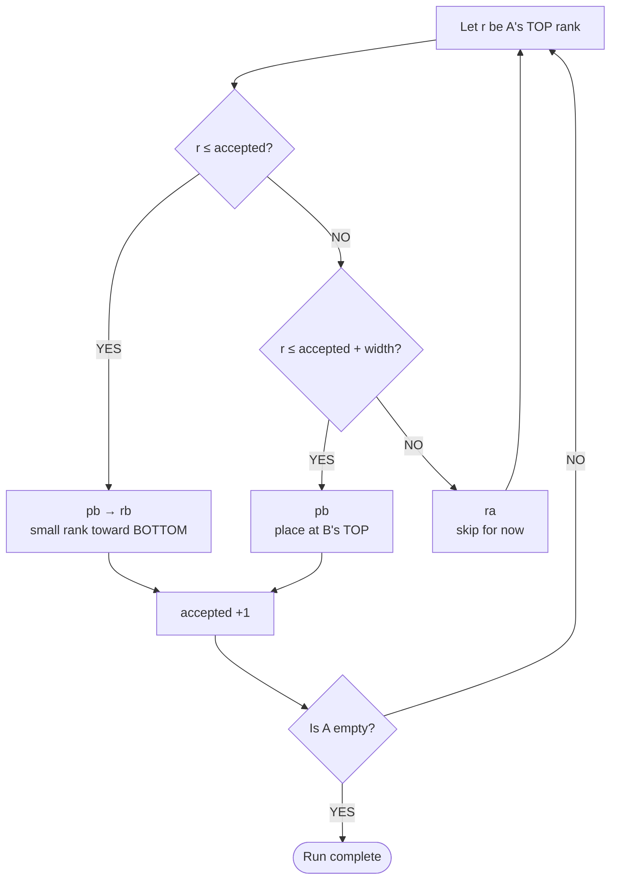

##### Concrete example with nine ranks

Ignore the original values and follow ranks only. The leftmost value is TOP.

> `A = [7, 1, 4, 0, 6, 2, 8, 3, 5]`
>
> `B = []`

Here `width = 3` and `accepted = 0`.

**1. Rank `7` is too early.** The currently accepted ranks are `0–3`, so use
`ra`. Nothing entered B; `accepted` stays `0`.

> `A = [1, 4, 0, 6, 2, 8, 3, 5, 7]`
>
> `B = []`

**2. Rank `1` is accepted.** Use `pb`; now `accepted = 1`.

> `A = [4, 0, 6, 2, 8, 3, 5, 7]`
>
> `B = [1]`

**3. The range slides right.** With `accepted = 1`, ranks through `4` are now
accepted. Push `4`; now `accepted = 2`.

> `A = [0, 6, 2, 8, 3, 5, 7]`
>
> `B = [4, 1]`

**4. Rank `0` belongs near B's BOTTOM.** Since `0 <= accepted`, use `pb` and
then `rb`. Immediately after `pb`, B is `[0, 4, 1]`; `rb` moves the new `0`
to the BOTTOM.

> `A = [6, 2, 8, 3, 5, 7]`
>
> `B = [4, 1, 0]`
>
> `accepted = 3`

The essential point is that every `pb` slides the range immediately. The
algorithm does not wait until all of `0–2` have moved.

Continuing the same rules produces:

> `A = []`
>
> `B = [8, 6, 4, 1, 0, 2, 3, 5, 7]`

The maximum `8` is at TOP and the next maximum `7` is at BOTTOM. B is not fully
sorted, but large values tend to be close to an end.

#### How Insertion reduces operations

Finding B's maximum is internal work and prints no operation. If B contains
`m` values and its maximum is at zero-based position `p` from TOP:

| Direction | Rotations needed |
|---|---:|
| `rb` | `p` |
| `rrb` | `m - p` |

For `m = 8` and `p = 6`, `rb` needs six rotations while `rrb` needs two. The
algorithm selects `rrb × 2`, then uses one `pa`.

> Operations for the current maximum = `min(p, m - p) + 1`

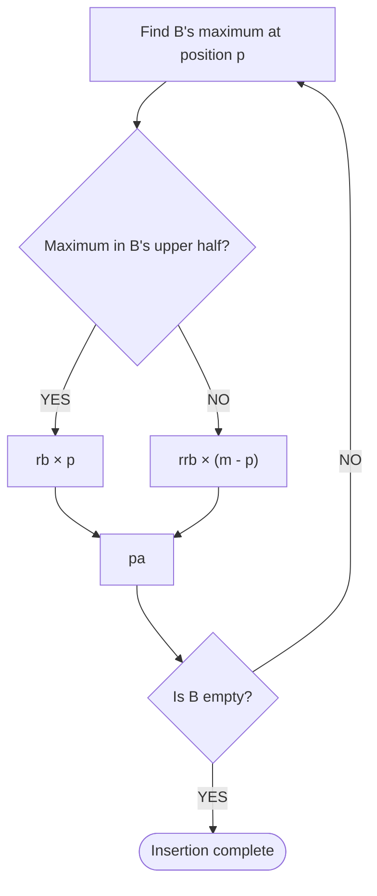

Now return every value from the B built above:

| Maximum | Location | Operations | A afterward |
|---:|---|---|---|
| `8` | TOP | `pa` | `[8]` |
| `7` | BOTTOM | `rrb → pa` | `[7, 8]` |
| `6` | TOP | `pa` | `[6, 7, 8]` |
| `5` | BOTTOM | `rrb → pa` | `[5, 6, 7, 8]` |
| `4` | TOP | `pa` | `[4, 5, 6, 7, 8]` |
| `3` | BOTTOM | `rrb → pa` | `[3, 4, 5, 6, 7, 8]` |
| `2` | BOTTOM | `rrb → pa` | `[2, 3, 4, 5, 6, 7, 8]` |
| `1` | TOP | `pa` | `[1, 2, 3, 4, 5, 6, 7, 8]` |
| `0` | TOP | `pa` | `[0, 1, 2, 3, 4, 5, 6, 7, 8]` |

B is now `[]`, and A is sorted. In original values, A is
`[1, 2, 3, 4, 5, 6, 7, 8, 9]`.

The Run tends to place large values near B's ends. Insertion then minimizes the
rotation for the **current maximum**. It does not prove that the complete output
sequence is globally shortest.

#### Why `O(n√n)`?

`width` is about `√n`. Instead of searching for exactly one next rank, the
algorithm accepts a moving range of up to `width` ranks while placing `n`
values.

> `n` values × a range of width `√n` = `O(n√n)`

This is a design estimate for printed operations; the actual count depends on
the initial order.

### Complex: Radix Sort

Complex converts ranks to binary and processes one bit at a time, starting at
the rightmost bit. A `0` bit goes to B with `pb`; a `1` bit stays in A through
`ra`. After one pass, every value in B returns through `pa`.

For `n = 8`, ranks `0–7` need three bits.

| Rank | Binary | Rank | Binary |
|---:|:---:|---:|:---:|
| `0` | `000` | `4` | `100` |
| `1` | `001` | `5` | `101` |
| `2` | `010` | `6` | `110` |
| `3` | `011` | `7` | `111` |

Before processing a bit, the program remembers how many values A contains.
Call that number `n`. Even though `pb` shrinks A, the pass ends after checking
the original `n` values once each.

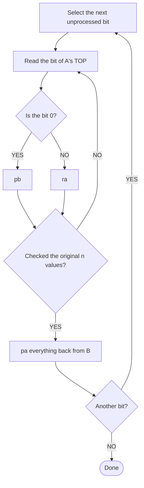

The `n values` in the diagram means the number present at the beginning of the
bit pass, not the number currently left in A.

Each bit needs `O(n)` operations. Ranks through `n - 1` need about `log2(n)`
bits.

> `O(n)` operations per bit × `O(log n)` bits = `O(n log n)`

### Ultra: OptiCSRI

The project-specific name splits into `Opti + C + SRI`.

| Part | Meaning |
|---|---|
| SRI | Spin Run Insertion: rotate, place values in B, then restore A |
| C | Circular: maintain B as a circular descending order |
| Opti | Optimization: choose the cheapest move and merge shared rotations |

> `SRI` → add Circular `C` to get `CSRI` → add Optimization `Opti` to get
> `OptiCSRI`

#### C: treat B as a circle

B remains descending when read from its maximum. Its displayed TOP may be
anywhere on that circle; rotating B does not destroy the circular order.

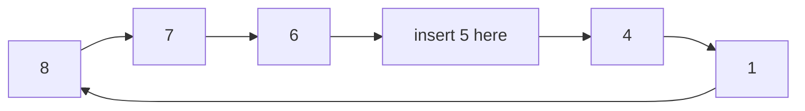

Rank `5` belongs between `6` and `4`. Whether the displayed TOP is `4`, `1`, or
another value, reading from `8` gives `8, 7, 6, 5, 4, 1`.

Once A is empty, Ultra rotates B's maximum to TOP only once. Repeating `pa`
then rebuilds A in ascending order.

Ultra does not reuse Medium's `accepted` and `width`; it is a separate strategy
that adds circular insertion and optimization to the SRI idea.

#### Opti: choose and merge cheap moves

For every candidate in A, Ultra evaluates four rotation combinations without
printing operations:

1. A and B upward: `ra` with `rb`
2. A and B downward: `rra` with `rrb`
3. A upward, B downward: `ra` with `rrb`
4. A downward, B upward: `rra` with `rb`

Shared directions become simultaneous operations.

| Before | After |
|---|---|
| `ra + rb` | `rr` |
| `rra + rrb` | `rrr` |

For example, `ra × 3 + rb × 2` costs five operations separately. Merging the
shared part gives `rr × 2 + ra`, only three operations.

> Same direction: `cost = max(A rotations, B rotations)`
>
> Opposite directions: `cost = A rotations + B rotations`

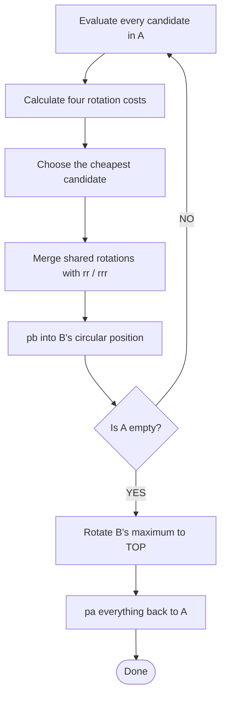

Moving one value can require `O(n)` rotations, repeated for `n` values, so the
conservative upper bound is `O(n²)`. In practice, candidate selection and shared
rotations often reduce the output. This greedy choice does not guarantee a
globally shortest sequence, so the benchmark calls it `operation optimized`.

### Adaptive: choose automatically

Adaptive is a selector, not another sorting algorithm. It chooses Simple,
Medium, or Complex from the input size and initial Disorder. Ultra is selected
only with `--ultra`.

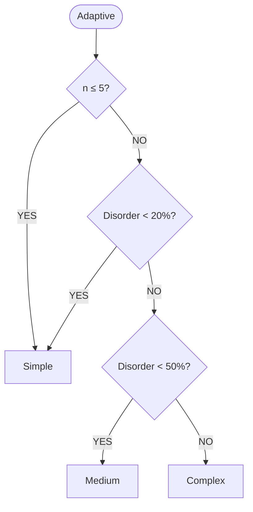

The comparisons are strict: exactly `20%` selects Medium, and exactly `50%`
selects Complex, unless `n <= 5`, which always selects Simple.

### Strategy comparison

| Strategy | Work per round | Number of rounds | Output estimate | Best fit |
|---|---:|---:|---:|---|
| Simple | `O(n)` | `O(n)` | `O(n²)` | Small or nearly sorted input |
| Medium | `O(n)` | `O(√n)` | `O(n√n)` | Moderately mixed input |
| Complex | `O(n)` | `O(log n)` bits | `O(n log n)` | Large, highly mixed input |
| Ultra | Up to `O(n)` per value | `n` values | Upper bound `O(n²)` | Fine-grained operation reduction |
| Adaptive | Depends on selection | Depends on selection | Same as selected strategy | Normal automatic use |

Select a strategy explicitly with:

```sh
./push_swap --simple 3 2 1
./push_swap --medium 8 3 7 1 6 2 5 4
./push_swap --complex 9 1 8 2 7 3 6 4 5
./push_swap --ultra 5 2 8 1 7 3 6 4
```

## Benchmark Output

With `--bench`, the program writes the initial disorder, selected strategy,
complexity, and per-instruction counts to standard error. Sorting instructions
remain on standard output, so benchmark output does not interfere with a pipe
to `checker`.

```sh
./push_swap --bench --adaptive 4 67 3 87 23
```

## Bonus: checker

`checker` receives stack A as arguments and reads instructions from standard
input. After executing every instruction, it writes `OK` when stack A is sorted
and stack B is empty; otherwise it writes `KO`. Invalid arguments or unknown
instructions produce `Error` on standard error.

Validate the instruction sequence generated by `push_swap`:

```sh
ARG="4 67 3 87 23"
./push_swap $ARG | ./checker $ARG
```

Count the generated operations:

```sh
ARG="4 67 3 87 23"
./push_swap $ARG | wc -l
```

Instructions can also be supplied manually:

```sh
printf 'sa\nrra\n' | ./checker 3 2 1
```

## File Structure

Root source files are numbered so that the processing flow is easy to follow.

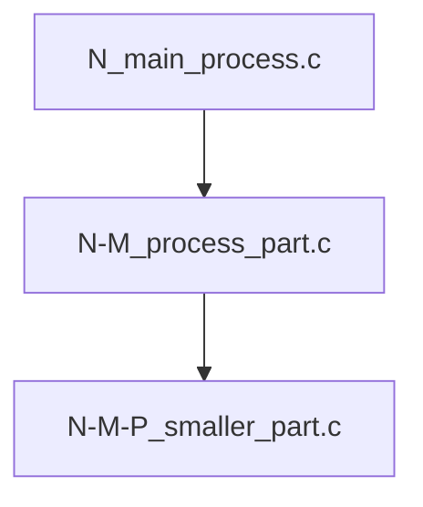

Main layout:

| Path | Purpose |
|---|---|
| `push_swap.c` / `push_swap.h` | Mandatory entry point and declarations |
| `[numbered sources].c` | Input, strategy selection, sorting, and reporting |
| `utils-*.c` | Stack operations and shared utilities |
| `Libft/` | Custom Libft |
| `ft_printf/` | Custom ft_printf |
| `commented/` | Commented Markdown copies |
| `commented-source-backup.tar.gz` | Commented C source backup |

For bonus submission, checker sources are separated into `*_bonus.c` /
`*_bonus.h` files as required by the subject and built by the Makefile's
`bonus` rule.

## Commented Source Backup

Explanatory comments are removed from the submitted `.c` / `.h` files. The
commented code is preserved in two forms:

- `commented/*.md`: Markdown copies with C syntax highlighting
- `commented-source-backup.tar.gz`: Backup containing real `.c` / `.h` files

List the archive without extracting it:

```sh
tar -tzf commented-source-backup.tar.gz
```

Extract outside the repository so the commented `.c` / `.h` files do not enter
the Norminette scan scope:

```sh
mkdir -p /tmp/push_swap-commented
tar -xzf commented-source-backup.tar.gz -C /tmp/push_swap-commented
```

The extracted files are placed in
`/tmp/push_swap-commented/commented-source-backup/`.

Remove the extracted backup after use:

```sh
rm -r /tmp/push_swap-commented
```

Extracting the archive inside the repository may cause the commented `.c` /
`.h` files to be scanned by Norminette. Keep the backup compressed before
submission.

## Cleanup

```sh
make clean   # Remove object files
make fclean  # Remove object files and executables
make re      # Clean and rebuild everything
```

## Resources

- [Push_swap subject](Push_swap.pdf)
- [日本語README](README.md)

## Use of AI

AI was used while expanding these READMEs for the following tasks:

- Organizing the explanation order for Big-O and each sorting strategy
- Drafting and refining beginner-friendly prose, examples, and Mermaid diagrams
- Checking the documentation against the actual source code
- Translating the validated Japanese documentation into natural English

AI suggestions were reviewed against the implementation and corrected where
necessary. This documentation work did not generate or modify the sorting
source code. The author remains responsible for the final content.

## contribution
### soinagak
- sort_main
- sinple_sort
- medium_sort
- radix_sort
- bonus

### harnakam
- Coordinate compression
- strategy
- parse
- main
- sort_optisri
- benchmark
- utils
- debug